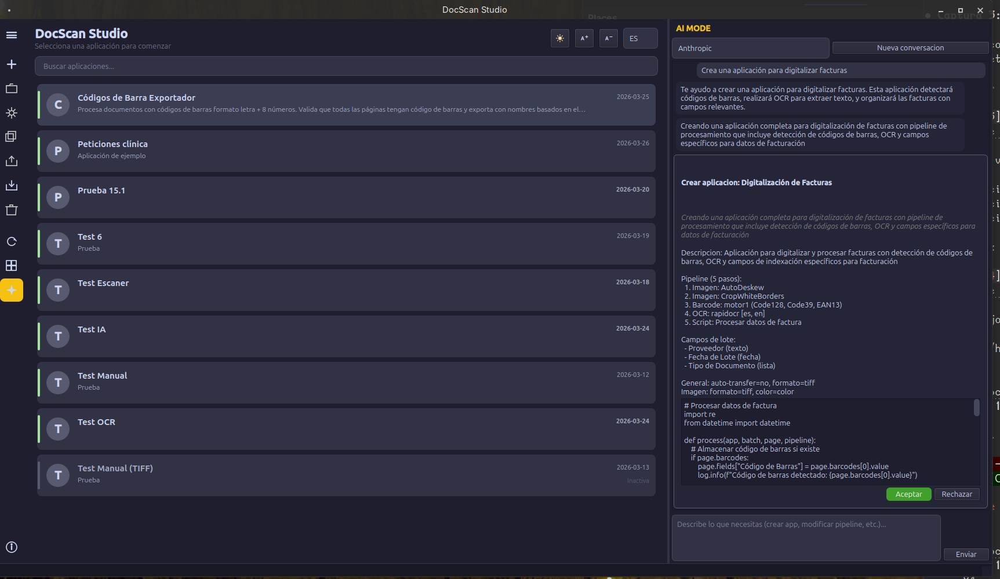

# :material-robot: AI Mode

AI Mode es un asistente conversacional integrado en el Launcher para crear y configurar aplicaciones mediante lenguaje natural.



## Configurar API key

1. Hacer clic en **AI MODE** en la sidebar
2. Introducir la API key de Anthropic u OpenAI
3. Las claves se cifran con **Fernet** (AES-128-CBC + HMAC-SHA256)

!!! security "Seguridad"
    Las API keys se almacenan cifradas en `~/.local/share/docscan/secrets.enc` y nunca en texto plano.

## Capacidades

- :material-plus-circle: Crear aplicaciones describiendo el caso de uso
- :material-pencil: Modificar configuración de apps existentes
- :material-pipe: Generar pipelines completos
- :material-code-tags: Escribir scripts personalizados
- :material-file-document: Documentar variables y campos disponibles

## Ejemplo

```
👤 Necesito una app para digitalizar albaranes. Cada albarán tiene
   un barcode Code128 con el número de pedido.

🤖 He creado "Albaranes" con:
   - Pipeline: AutoDeskew → Barcode Motor 2 → Script separador
   - Campo de lote: "numero_pedido"
   - Transferencia: /salida/{numero_pedido}/
```

## Pipeline Assistant

Cada aplicación tiene un **Pipeline Assistant** en el configurador con contexto específico del pipeline configurado.

