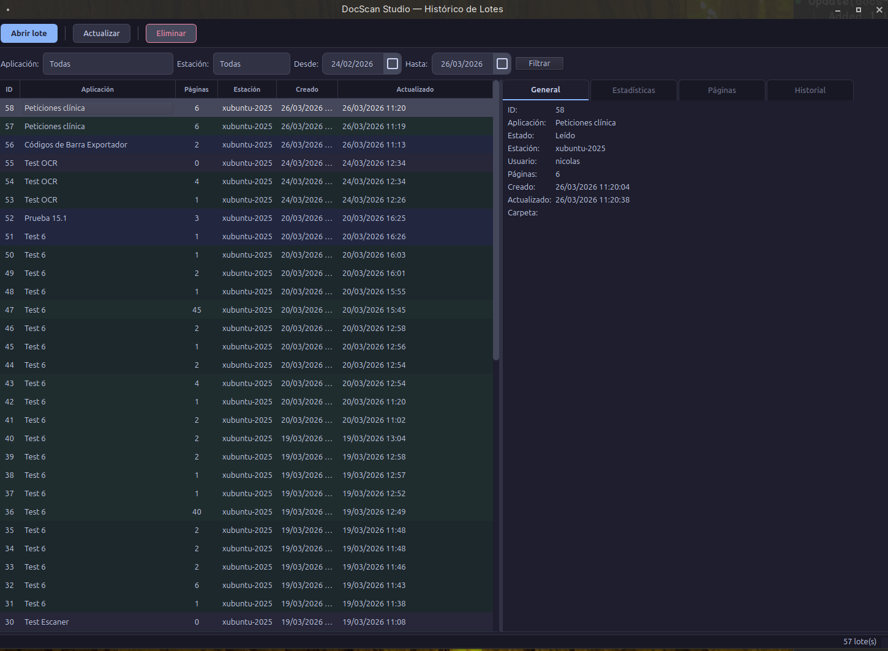

# :material-folder-multiple: Gestión de lotes

El Gestor de Lotes permite consultar el histórico completo de lotes procesados.

## Filtros

| Filtro | Descripción |
|--------|-------------|
| Aplicación | Filtrar por aplicación específica |
| Estación | Filtrar por ordenador/hostname |
| Fecha desde/hasta | Período de búsqueda |

## Estados del lote

| Estado | Descripción |
|--------|-------------|
| Abierto | En proceso de captura |
| Procesado | Pipeline completado |
| Transferido | Exportado al destino |
| Error | Error durante procesamiento |

## Acciones

- **Abrir lote**: Reabre un lote anterior en el Workbench
- **Eliminar**: Borra el lote y sus imágenes (irreversible)
- **Actualizar**: Refresca la lista (también se actualiza automáticamente cada 20s)

## Reprocesar

Un lote reabierto permite:

- Reprocesar una página individual con **Ctrl+P**
- Las páginas pendientes se procesan automáticamente al reabrir
