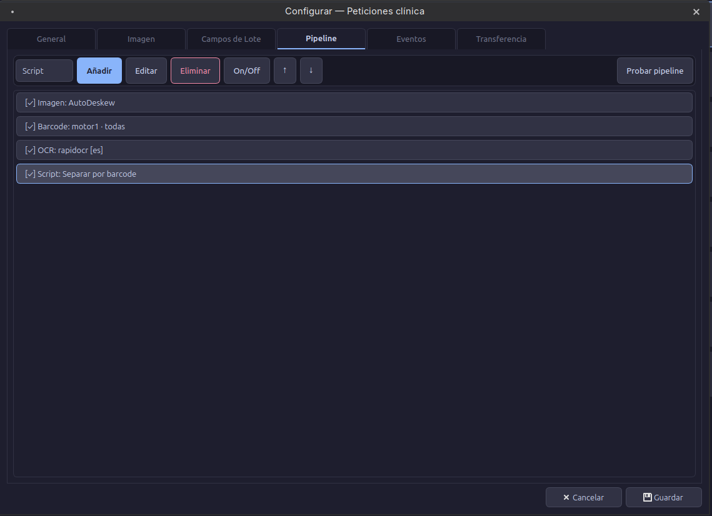
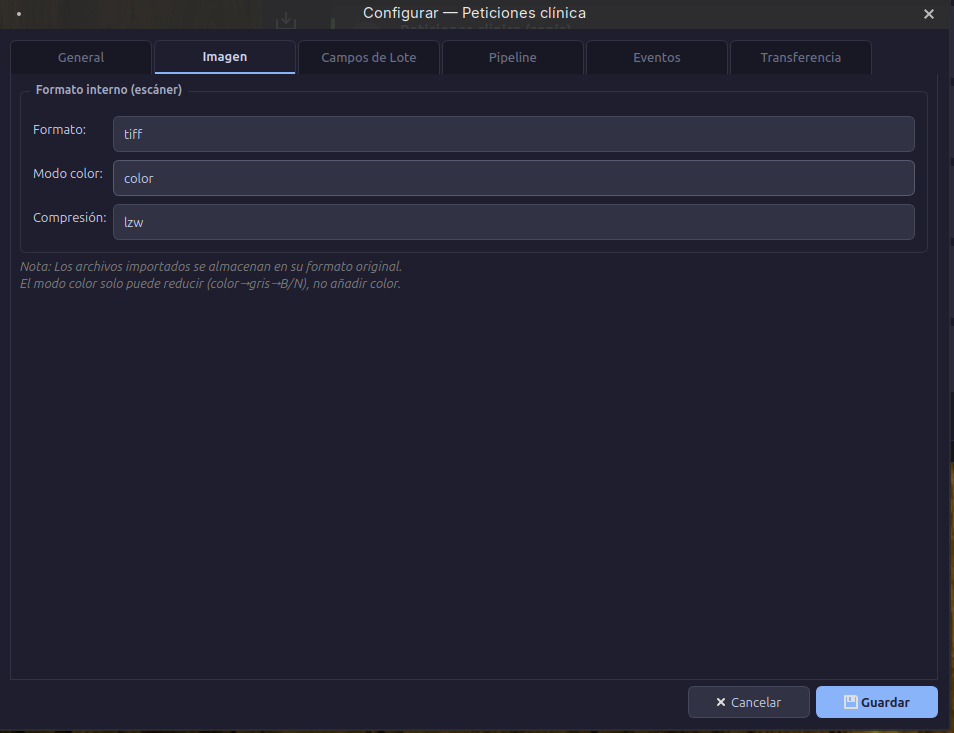

# :gear: Configurador

El configurador permite ajustar cada aspecto de una aplicación a través de **6 pestañas**.

## Pestaña General

Configuración básica de la aplicación.

| Opción | Descripción |
|--------|-------------|
| Nombre | Nombre visible en el Launcher |
| Descripción | Texto descriptivo del propósito |
| Color | Color identificativo en la lista |
| Auto-transferencia | Transferir automáticamente al completar el pipeline |
| Detección de blancos | Excluir páginas en blanco automáticamente |
| Barcode manual | Expresión regex o valor fijo para barcodes manuales |

## Pestaña Imagen

Define el formato de captura: formato de fichero, modo de color y compresión.

## Pestaña Campos de lote

Campos dinámicos que el operador rellena en el Workbench.

| Tipo | Widget | Configuración |
|------|--------|---------------|
| Texto | Campo libre | — |
| Fecha | Calendario | Formato de fecha |
| Lista | Desplegable | Valores separados por coma |
| Numérico | Spinner | Mínimo, máximo, paso |

## Pestaña Pipeline

Ver [Pipeline](pipeline.md) para la documentación completa.

## Pestaña Eventos

Ver [Scripting](scripting.md) para los eventos del ciclo de vida.

## Pestaña Transferencia

Ver [Transferencia](transfer.md) para las opciones de exportación.
