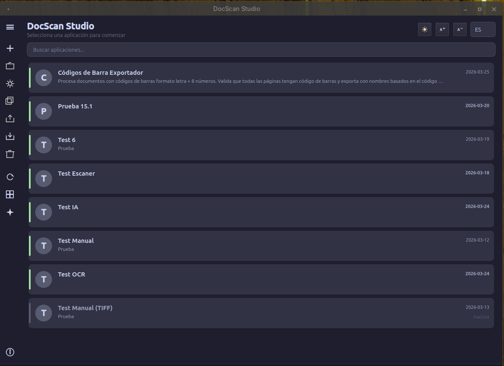
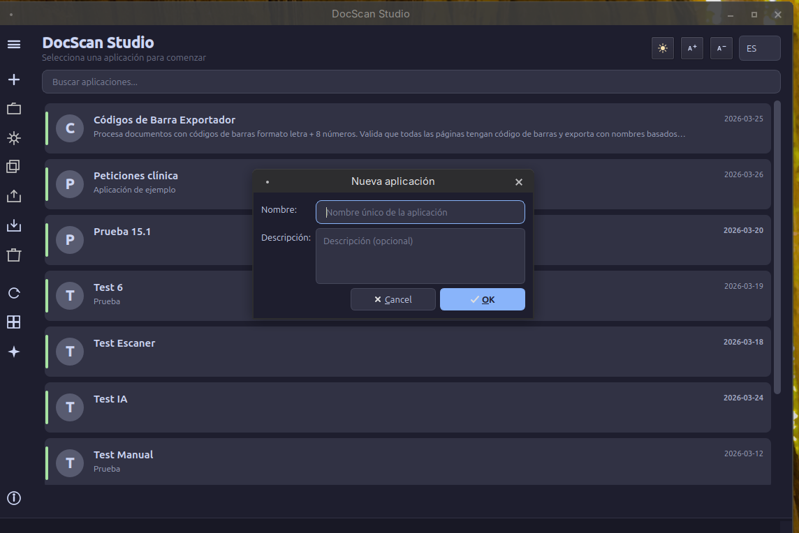

# :house: Launcher

El Launcher es la ventana principal de DocScan Studio. Desde aquí se gestionan todas las **aplicaciones** (perfiles de procesamiento).

## Sidebar

La sidebar izquierda proporciona acceso rápido a todas las acciones. Se puede expandir/colapsar haciendo clic en el icono de menú.

| Botón | Acción | Descripción |
|-------|--------|-------------|
| :material-plus: Nueva | Crear aplicación | Diálogo para nombre y descripción |
| :material-folder-open: Abrir | Abrir workbench | Abre la aplicación seleccionada |
| :material-cog: Configurar | Editar configuración | Abre el configurador con 6 pestañas |
| :material-content-copy: Clonar | Duplicar | Copia exacta de la aplicación |
| :material-upload: Exportar | Fichero .docscan | Exporta como JSON portable |
| :material-download: Importar | Desde .docscan | Carga aplicación desde fichero |
| :material-delete: Eliminar | Borrar aplicación | Elimina app y datos (irreversible) |
| :material-refresh: Actualizar | Refrescar lista | Recarga desde la base de datos |
| :material-view-grid: Gestor de Lotes | Histórico | Consultar lotes anteriores |
| :material-robot: AI MODE | Asistente IA | Panel conversacional con IA |
| :material-information: Acerca de | Información | Versión y créditos |

## Crear una aplicación

1. Clic en **Nueva** en la sidebar
2. Introducir nombre y descripción
3. La aplicación aparece en la lista
4. Seleccionarla y hacer clic en **Configurar** para personalizar el pipeline

## Exportar / Importar

Las aplicaciones se exportan como ficheros `.docscan` (JSON) que incluyen:

- Configuración general
- Pipeline completo
- Campos de lote
- Eventos y scripts
- Configuración de transferencia

!!! warning "No se exportan"
    Las API keys, los lotes ni las imágenes no se incluyen en la exportación.

## Tema e idioma

La barra superior del Launcher permite:

- :material-brightness-6: Alternar entre tema **claro** y **oscuro**
- :material-translate: Cambiar idioma: **Español**, **English**, **Català**

!!! note
    El cambio de idioma requiere reiniciar la aplicación.
