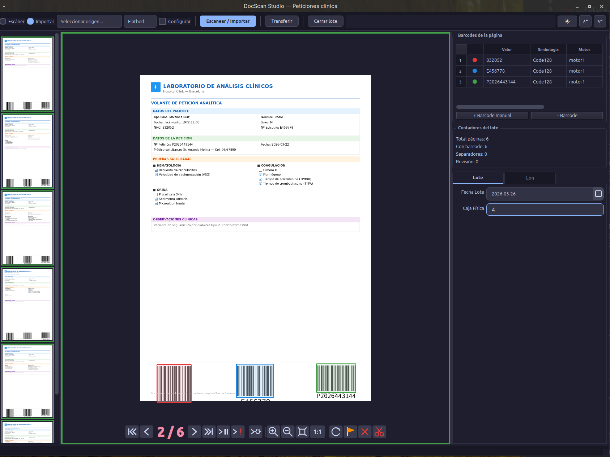

# :material-monitor: Workbench

El Workbench es la ventana de explotación donde se realiza la captura y procesamiento diario.

## Áreas de la interfaz

El Workbench se compone de cinco áreas:

1. **Barra de herramientas** — Escanear, importar, transferir, cerrar lote
2. **Panel de miniaturas** — Miniaturas con estados de color
3. **Visor de documentos** — Imagen con zoom, pan y overlays
4. **Panel de barcodes** — Códigos detectados con contadores
5. **Panel de metadatos** — Campos de lote, verificación y log

## Estados de página

Las miniaturas muestran el estado mediante bordes de color:

| Color | Estado |
|-------|--------|
| :material-circle:{ style="color: #4caf50" } Verde | Procesada correctamente |
| :material-circle:{ style="color: #ff9800" } Naranja | Pendiente de revisión |
| :material-circle:{ style="color: #9e9e9e" } Gris | Excluida |
| :material-circle:{ style="color: #f44336" } Rojo | Error en el procesamiento |

## Visor de documentos

El visor central permite:

- **Zoom**: Ctrl++ / Ctrl+- o rueda del ratón
- **Pan**: Clic y arrastrar
- **Ajustar a ventana**: Ctrl+F
- **Rotar**: R (derecha) / Shift+R (izquierda)
- **Overlays**: Visualización de barcodes y regiones OCR sobre la imagen

## Escaneo

1. Opcionalmente marcar **Configurar escáner** para ajustar opciones
2. Clic en **Escanear** (o Ctrl+S)
3. Las páginas se importan y procesan automáticamente por el pipeline

## Importación

- Clic en **Importar** (Ctrl+I) y seleccionar ficheros
- O **arrastrar** ficheros directamente sobre el visor
- Formatos: TIFF (multi-página), JPEG, PNG, BMP, PDF
